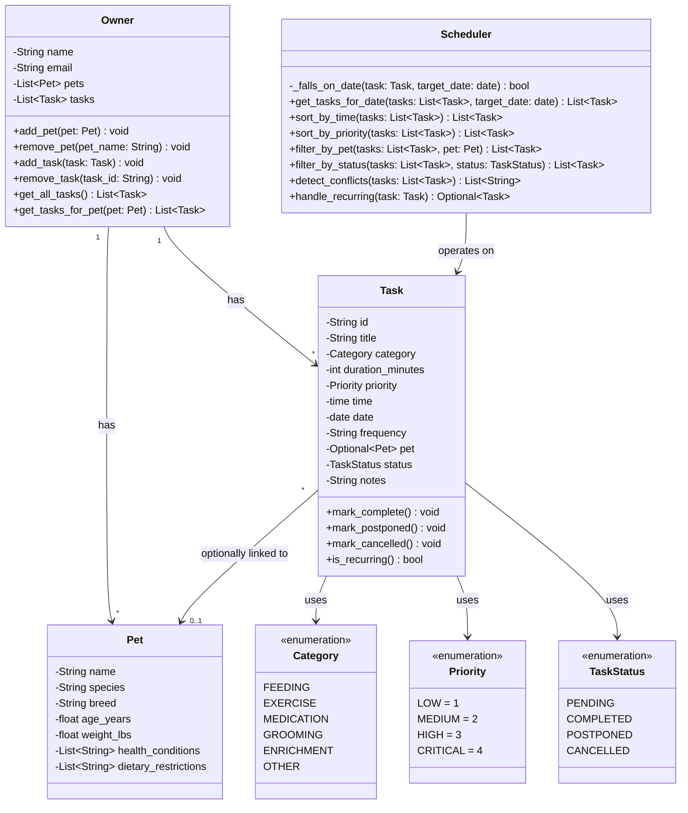

```mermaid
classDiagram
    class Category {
        <<enumeration>>
        FEEDING
        EXERCISE
        MEDICATION
        GROOMING
        ENRICHMENT
        OTHER
    }

    class Priority {
        <<enumeration>>
        LOW = 1
        MEDIUM = 2
        HIGH = 3
        CRITICAL = 4
    }

    class TaskStatus {
        <<enumeration>>
        PENDING
        COMPLETED
        POSTPONED
        CANCELLED
    }

    class Owner {
        -String name
        -String email
        -List~Pet~ pets
        -List~Task~ tasks
        +add_pet(pet: Pet) void
        +remove_pet(pet_name: String) void
        +add_task(task: Task) void
        +remove_task(task_id: String) void
        +get_all_tasks() List~Task~
        +get_tasks_for_pet(pet: Pet) List~Task~
    }

    class Pet {
        -String name
        -String species
        -String breed
        -float age_years
        -float weight_lbs
        -List~String~ health_conditions
        -List~String~ dietary_restrictions
    }

    class Task {
        -String id
        -String title
        -Category category
        -int duration_minutes
        -Priority priority
        -time time
        -date date
        -String frequency
        -Optional~Pet~ pet
        -TaskStatus status
        -String notes
        +mark_complete() void
        +mark_postponed() void
        +mark_cancelled() void
        +is_recurring() bool
    }

    class Scheduler {
        -_falls_on_date(task: Task, target_date: date) bool
        +get_tasks_for_date(tasks: List~Task~, target_date: date) List~Task~
        +sort_by_time(tasks: List~Task~) List~Task~
        +sort_by_priority(tasks: List~Task~) List~Task~
        +filter_by_pet(tasks: List~Task~, pet: Pet) List~Task~
        +filter_by_status(tasks: List~Task~, status: TaskStatus) List~Task~
        +detect_conflicts(tasks: List~Task~) List~String~
        +handle_recurring(task: Task) Optional~Task~
    }

    Owner "1" --> "*" Pet : has
    Owner "1" --> "*" Task : has
    Task "*" --> "0..1" Pet : optionally linked to
    Task --> Category : uses
    Task --> Priority : uses
    Task --> TaskStatus : uses
    Scheduler --> Task : operates on
```
